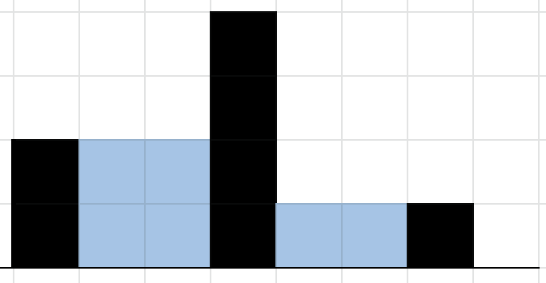

# Rain

Given a list of non-negative integers representing walls of width 1, calculate how much water will be retained after it rains.

- Prototype: def rain(walls)
walls is a list of non-negative integers.
- Return: Integer indicating total amount of rainwater retained.
- Assume that the ends of the list (before index 0 and after index walls[-1]) are not walls, meaning they will not retain water.
- If the list is empty return 0

```
user:~/0x10$ cat 0_main.py
#!/usr/bin/python3
"""
0_main
"""
rain = __import__('0-rain').rain

if __name__ == "__main__":
    walls = [0, 1, 0, 2, 0, 3, 0, 4]
    print(rain(walls))
    walls = [2, 0, 0, 4, 0, 0, 1, 0]
    print(rain(walls))

user:~/0x10$ 
user:~/0x10$ ./0_main.py
6
6
user:~/0x10$ 
```

### Visual representation of the walls [0, 1, 0, 2, 0, 3, 0, 4]


### Visual representation of the walls [2, 0, 0, 4, 0, 0, 1, 0]

## Author
* **Manuel Torres Vesga** - [matcls](https://github.com/matcls)